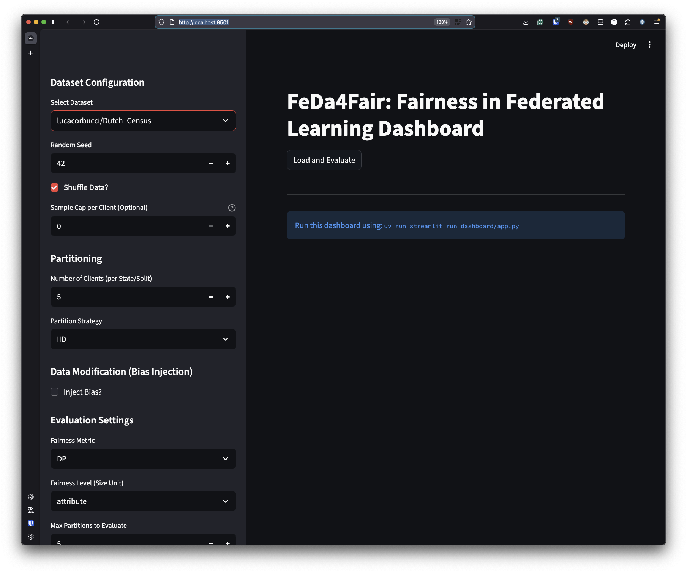
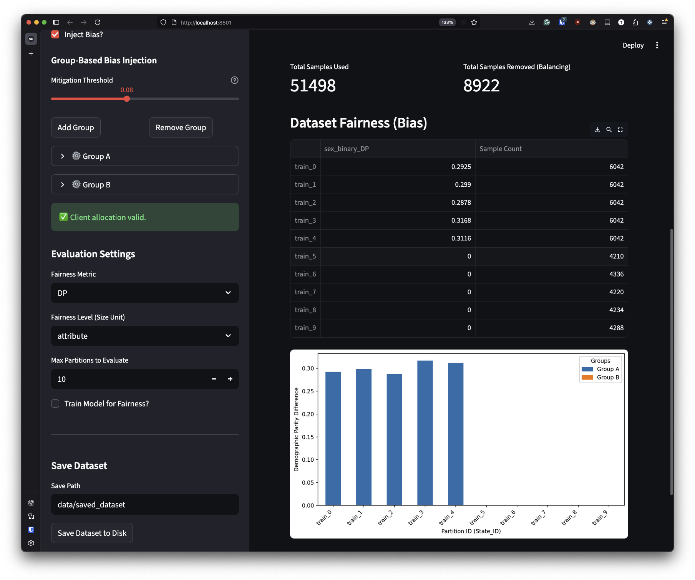

# FeDa4Fair

<p align="center">
  
</p>

**FeDa4Fair** is a library designed to facilitate the study of fairness in Federated Learning (FL). It allows researchers and practitioners to generate, manipulate, and benchmark datasets controlling bias distributions, enabling reproducible evaluation of fairness-aware FL algorithms.

Unlike standard FL benchmarks that often focus solely on data heterogeneity (e.g., non-IID label distributions), FeDa4Fair specifically addresses **fairness heterogeneity**. It simulates realistic scenarios where different clients (silos or devices) exhibit varying levels of bias against sensitive attributes (e.g., based on race or gender) or toward different values of the same sensitive attributes.

The goal of this library is to enable researchers and practitioners to evaluate fair FL methods in scenarios [that are usually underexplored](https://dl.acm.org/doi/full/10.1145/3715275.3732152).

## What This Library Does

FeDa4Fair provides a unified interface to:

1.  **Create Federated Datasets**: Easily partition tabular datasets into federated settings (Cross-Silo or Cross-Device).
2.  **Inject Controlled Bias**: systematically introduce **Attribute Skew** (varying population demographics) or **Value Skew** (varying conditional label distributions).
3.  **Group-Based Heterogeneity**: Partition clients into groups with distinct bias profiles sampled from **Normal Distributions**.
4.  **Evaluate Fairness**: Built-in tools to measure common fairness metrics like **Demographic Parity (DP)** and **Equalized Odds (EO)** both globally and at the client level.
5.  **Benchmark**: Access ready-to-use, pre-processed datasets with defined fairness characteristics.

## Supported Dataset Types

The library supports creating distinct types of federated datasets to model different real-world environments:

*   **Cross-Silo**: Simulates a setting with a small number of large clients (e.g., hospitals, banks, or states). 
    *   *Example*: Partitioning US Census data by State.
*   **Cross-Device**: Simulates a setting with a large number of small clients (e.g., mobile phones).
    *   *Example*: Partitioning a dataset into hundreds of small, non-overlapping subsets.

## Available Datasets

We provide 4 pre-configured benchmarking datasets derived from the ACS (American Community Survey) data, ready for immediate use:

1.  **Attribute-Silo**: A cross-silo dataset where the **attribute bias** (demographics) varies naturally across clients (States). ([Link](https://huggingface.co/datasets/lucacorbucci/silo-attribute))
2.  **Attribute-Device**: A cross-device version where clients simulate devices with varying attribute distributions. ([Link](https://huggingface.co/datasets/lucacorbucci/device-attribute))
3.  **Value-Silo**: A cross-silo dataset where **value bias** (correlation between race and outcome) varies across clients. ([Link](https://huggingface.co/datasets/lucacorbucci/silo-value))
4.  **Value-Device**: A cross-device version with varying value bias. ([Link](https://huggingface.co/datasets/lucacorbucci/device-value))

Additionally, FeDa4Fair has first-class support for:
*   **ACSIncome** (Locally downloaded using Folktables)
*   **ACSEmployment** (Locally downloaded using Folktables)
*   **Dutch Census** (Downloaded from Hugging Face Hub)
*   **Any Hugging Face Dataset** (see below)

# How to use FeDa4Fair

## Clone the repository

```bash
git clone https://github.com/xheilmann/FeDa4Fair.git
cd FeDa4Fair
```


## Create the environment

First of all we need to install [uv](https://github.com/astral-sh/uv):

```bash
curl -LsSf https://astral.sh/uv/install.sh | sh
```

Then we can create the environment:

```bash
uv venv
uv sync
```

We suggest you create the helper folder `data_stats`:

```bash
mkdir src/FeDa4Fair/data_stats
```

## Tutorial and Examples

A detailed example/tutorial on how to use the library can be found in the example folder:

* We provide an example with the [ACS Income](examples/acs_income.ipynb) dataset
* We provide an example with the [Dutch Census](examples/dutch.ipynb) dataset
* We provide an example with an image dataset, [CelebA](examples/celeba.ipynb), using data from Hugging Face Hub.
* We provide an example of how to create a dataset with conflicting values for the same sensitive attribute, [Dutch Value](examples/dutch_value.ipynb).
* We provide an example of how to create a dataset with conflicting attributes for different groups of clients, [Dutch Attribute](examples/dutch_attribute.ipynb).


## Use of the library

FeDa4Fair supports loading arbitrary datasets from Hugging Face Hub or local files.

### 1. Hugging Face Datasets

You can load any dataset available on Hugging Face Hub by specifying its name. 

It is important to note that the dataset should have a tabular format. This does not mean that the library only supports tabular data; for instance, image datasets with associated metadata can also be used. However, the dataset must be structured in a way that allows FeDa4Fair to interpret it as tabular data. 

For instance, Celeba is an image dataset, but it includes metadata that can be treated as tabular data and that allows us to define sensitive attributes and labels.

```python
from FeDa4Fair.dataset.fair_dataset import FairFederatedDataset

fds = FairFederatedDataset(
    dataset="flwrlabs/celeba",
    split="all",
    partitioners={"train": num_total_clients},
    label_name="Smiling",
    sensitive_attributes=["Male"],
    fairness_metric="DP",
    modification_dict=mod_dict,
)

fds.prepare()
```

In this case, we load the CelebA dataset, partition it into `num_total_clients`, and set "Smiling" as the label and "Male" as the sensitive attribute. The `modification_dict` can be used to specify bias injection parameters.
An example of `modification_dict` for attribute skew could be:

```python
group_configs = [
    {
        "group_id": "Group A (Unfair to Female)",
        "num_clients": 75,
        "sensitive_attr": "Male",
        "sensitive_value": "false",  # Female
        "drop_mean": 0.2,
        "drop_std": 0.05,
        "flip_mean": 0.1,
        "flip_std": 0.02,
    },
    {
        "group_id": "Group B (Unfair to Male)",
        "num_clients": 75,
        "sensitive_attr": "Male",
        "sensitive_value": "true",  # Male
        "drop_mean": 0.3,
        "drop_std": 0.05,
        "flip_mean": 0.2,
        "flip_std": 0.02,
    },
]
mod_dict = generate_bias_by_groups(num_total_clients=num_total_clients, group_configs=group_configs)
```

This configuration creates two groups of clients with different bias profiles regarding the "Male" attribute. 

By specifying "all" in the `split` parameter, we ensure that all the dataset splits (train, validation, test) available on Hugging face are downloaded and merged into a single dataset before partitioning. Later, we will split the data into train, validation, and test sets at the client level to support federated learning scenarios.

See [the notebook](examples/celeba.ipynb) for a complete example. 


### 2. Local Datasets

To use a local dataset, organize your data in a folder structure supported by Hugging Face `imagefolder` or `folder` builders, or simply point to the directory if it contains metadata.

```python
from FeDa4Fair.dataset.fair_dataset import FairFederatedDataset

ffds = FairFederatedDataset(
    dataset="ACSIncome",
    states=["CT", "AK"],
    partitioners={"CT": 5, "AK": 2},
    fl_setting=None,
    fairness_metric="DP",
    fairness_level="attribute",
)

```

See [the notebook](examples/acs_income.ipynb) for an example using ACSIncome locally downloaded.

### 3. Create datasets with conflicting attribute level biases

The library allows you to create federated datasets where different groups of clients exhibit conflicting biases toward different sensitive attributes.

For instance, let's consider the Dutch dataset, where we want to create two groups of clients: one group unfair toward the sensitive attribute "sex_binary" and not unfair toward the "Marital_status", and another group unfair toward "Marital_status" and not unfair toward "sex_binary".

We have to define the following group configurations:

```python
num_clients = 100
group_split_idx = 50 
client_names = [str(i) for i in range(num_clients)]

# We use the new generate_multiobjective_bias function which allows 
# defining multiple attribute modifications per group in a single structure.

group_configs = [
    {
        "group_id": "Group A",
        "num_clients": group_split_idx,
        "configs": [
            # Mitigate sex_binary
            {"attribute": "sex_binary", "mitigate": True},
            # Bias Marital_status (Drop value 0)
            {
                "attribute": "Marital_status",
                "value": 0,
                "drop_mean": 0.3, "drop_std": 0.1,
                "flip_mean": 0.2, "flip_std": 0.05
            }
        ]
    },
    {
        "group_id": "Group B",
        "num_clients": num_clients - group_split_idx,
        "configs": [
            # Bias sex_binary (Drop value 1)
            {
                "attribute": "sex_binary",
                "value": 1,
                "drop_mean": 0.4, "drop_std": 0.1,
                "flip_mean": 0.3, "flip_std": 0.05
            },
            # Mitigate Marital_status
            {"attribute": "Marital_status", "mitigate": True}
        ]
    }
]

modifications = generate_multiobjective_bias(num_clients, group_configs, client_names)
```

Then, we can use this dictionary to create the federated dataset:

```python
fds = FairFederatedDataset(
    dataset="lucacorbucci/Dutch_census_binary_marital_status",
    split="all",
    partitioners={"train": num_clients},
    label_name="occupation_binary",
    sensitive_attributes=["sex_binary", "Marital_status"],
    modification_dict=modifications,
    fl_setting="cross-silo",
    perc_train_val_test=[0.8, 0.2],
    client_names=client_names
)

print("Preparing dataset...")
fds.prepare()
```

As you will see in the [Dutch Attribute notebook](examples/dutch_attribute.ipynb), this will create a federated dataset with two groups of clients exhibiting conflicting biases toward different sensitive attributes. In the example we can also visualize the unfairness metrics at the client level to confirm the desired bias profiles.

### 4. Create datasets with conflicting value level biases

The library also allows you to create federated datasets where different groups of clients exhibit conflicting biases toward different values of the same sensitive attribute.

For instance, let's consider the Dutch dataset again, where we want to create two groups of clients: one group unfair toward value 1 of the sensitive attribute "sex_binary" and another group unfair toward value 0 of the same sensitive attribute.

We have to define the following group configurations:

```python

num_clients = 100
group_split = 50
client_names = [str(i) for i in range(num_clients)]

# Configure groups to show opposite bias directions for 'sex_binary'
# We use aggressive bias injection to ensure the model learns the bias.
group_configs = [
    {
        "group_id": "Group A (Favors 1)",
        "num_clients": group_split,
        "configs": [
            {
                "attribute": "sex_binary",
                "value": 0,  # Bias against 0 (favors 1)
                "drop_mean": 0.9, "drop_std": 0.05,
                "flip_mean": 0.3, "flip_std": 0.05
            }
        ]
    },
    {
        "group_id": "Group B (Favors 0)",
        "num_clients": num_clients - group_split,
        "configs": [
            {
                "attribute": "sex_binary",
                "value": 1,  # Bias against 1 (favors 0)
                "drop_mean": 0.3, "drop_std": 0.05,
                "flip_mean": 0.1, "flip_std": 0.05
            }
        ]
    }
]

modifications = generate_multiobjective_bias(num_clients, group_configs, client_names)
```

This configuration creates two groups of clients with opposite bias directions regarding the "sex_binary" attribute. 
You can find a complete example in the [Dutch value notebook](examples/dutch_value.ipynb).


## How to use the dashboard

FeDa4Fair includes a dashboard for easily split dataset into clients and visualize fairness metrics.

| :warning: WARNING           |
|:----------------------------|
| The dashboard is still in an early development stage, and some features may not work as expected. |


To launch the dashboard, run the following command from the dashboard folder:

```
uv run streamlit run app.py
```

This will start a local server, and you can access the dashboard through your web browser at `http://localhost:8501`.


<p align="center">
  
</p>

Through the dashboard, you can select the dataset, define the federated setting (Cross-Silo or Cross-Device), specify bias injection parameters, and visualize the resulting fairness metrics across clients.

<p align="center">
  
</p>

## Citation

If you use FeDa4Fair in your research, please cite the following paper:

```
@misc{heilmann2025feda4fairclientlevelfederateddatasets,
      title={FeDa4Fair: Client-Level Federated Datasets for Fairness Evaluation}, 
      author={Xenia Heilmann and Luca Corbucci and Mattia Cerrato and Anna Monreale},
      year={2025},
      eprint={2506.21095},
      archivePrefix={arXiv},
      primaryClass={cs.LG},
      url={https://arxiv.org/abs/2506.21095}, 
}
```